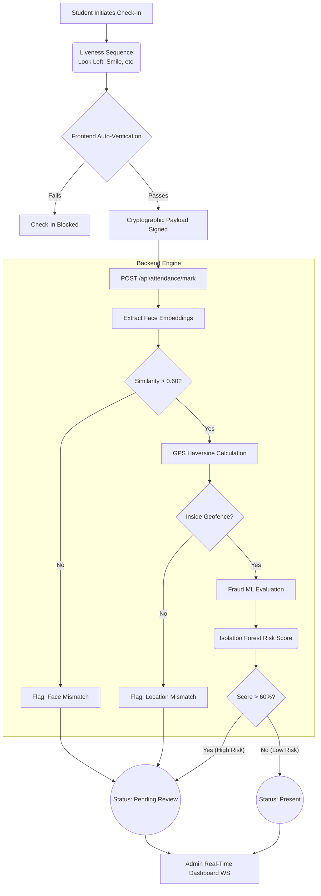

<div align="center">
  
  <h1 align="center">AI-Powered Anti-Fraud Attendance System</h1>
  
  <p align="center">
    <strong>A next-generation biometric attendance management system built with real-time liveness checks, GPS geofencing, and ML fraud detection.</strong>
  </p>
  
  <p align="center">
    
    
    
    
  </p>
</div>

<br />

## 📑 Table of Contents
- [✨ Core Features](#-core-features)
- [🏗️ System Architecture](#-system-architecture)
- [🛠️ Tech Stack](#-tech-stack)
- [🛡️ Multi-Layered Security & Fraud Detection](#-multi-layered-security--fraud-detection)
- [🚀 Quick Start](#-quick-start)
- [📊 Admin Telemetry](#-admin-telemetry)

---

## 📖 Project Description

Traditional attendance systems are increasingly vulnerable to proxy check-ins, GPS spoofing, and biometric manipulation. The **AI-Powered Anti-Fraud Attendance System** is a robust, end-to-end solution designed to solve these exact vulnerabilities. 

Built for modern institutions and enterprises, this platform leverages state-of-the-art Deep Learning models (YuNet and SFace) to instantly verify student identities. To combat sophisticated spoofing (such as holding up a photo or using a virtual camera), the system enforces an interactive **Active Liveness Sequence**, requiring users to physically rotate their heads, smile, and react to dynamic on-screen color flashes.

Every check-in is cross-referenced in real-time by a Scikit-Learn **Isolation Forest ML Engine**, which analyzes the user's distance from campus, device fingerprint consistency, travel speed, and browser tampering. Flagged attempts are instantly quarantined and sent to the **Live Admin Dashboard**, where administrators can view an AI-generated explanation of exactly why the fraud engine intercepted the check-in.

---

## ✨ Core Features

| Feature | Description | Status |
| :--- | :--- | :---: |
| **Biometric Face Match** | High-precision face mapping using OpenCV **YuNet** and **SFace** ONNX models. | ✅ |
| **Active Liveness Detection** | Prevents spoofing via head rotation (look left/right), smile checks, and screen flash color reflections. | ✅ |
| **Dynamic GPS Geofencing** | Validates user coordinates against dynamic campus boundaries using the Haversine formula. | ✅ |
| **Fraud Detection Engine** | Scikit-Learn **Isolation Forest** model to detect impossible travel, device sharing, and odd hours. | ✅ |
| **Anti-Tampering** | Blocks Virtual Cameras (OBS) and detects if Developer Tools/Console are active during check-in. | ✅ |
| **XAI (Explainable AI)** | Breaks down fraud risk scores to admins with exact feature-importance weightings. | ✅ |
| **Live Admin Dashboard** | Real-time WebSocket feed, Chart.js telemetry, and CSV/PDF export generation. | ✅ |

---

## 🏗️ System Architecture

The following flowchart demonstrates the lifecycle of a single attendance check-in request, detailing the rigid security checkpoints evaluated by the backend.



---

## 🛠️ Tech Stack

### 🎨 Frontend Environment
| Technology | Usage |
| :--- | :--- |
| **React (Vite)** | Core UI framework for blazing fast HMR and optimized builds. |
| **TailwindCSS** | Utility-first CSS framework for glassmorphism styling and dark-mode aesthetic. |
| **Lucide React** | Modern SVG icon library for sleek UI components. |
| **Chart.js (React-Chartjs-2)** | Used in the Admin Dashboard for KPI telemetry, line charts, and donut distributions. |
| **HTML5 Media API** | For native webcam access and canvas rendering. |

### ⚙️ Backend Environment
| Technology | Usage |
| :--- | :--- |
| **Python 3.10+** | Core server runtime. |
| **FastAPI** | High-performance asynchronous API routing, WebSockets, and automatic Swagger docs. |
| **SQLAlchemy** | SQL ORM for managing users, attendance records, and fraud logs. |
| **SQLite / PostgreSQL** | Database storage. |
| **PyJWT & Passlib** | Secure Bearer authentication and password hashing. |

### 🧠 AI & Machine Learning Pipeline
| Technology | Usage |
| :--- | :--- |
| **OpenCV** | Image decoding and manipulation. |
| **YuNet (ONNX)** | Ultra-lightweight deep learning face detection. |
| **SFace (ONNX)** | Face recognition and 128-d embedding extraction. |
| **Scikit-Learn** | `IsolationForest` implementation for anomaly-based fraud detection. |

---

## 🛡️ Multi-Layered Security & Fraud Detection

This system calculates a comprehensive `fraud_risk_score` (0-100%). Any score above **60%** automatically quarantines the record for Admin Review. 

The engine evaluates:
1. **Impossible Travel Check:** Blocks check-ins if the user travels unrealistically fast between two IP/GPS locations within a short timeframe.
2. **Console Tampering:** Detects if the browser's developer tools are opened during the liveness sequence.
3. **Device Fingerprint Sharing:** Flags check-ins if multiple users log in from the exact same hardware fingerprint in a short window.
4. **Virtual Camera Blacklist:** Rejects simulated or loopback webcam feeds (e.g., OBS Virtual Camera).
5. **Texture/Focus Analysis:** Evaluates Laplacian variance to detect printed photos held up to the camera.

---

## 🚀 Quick Start

### 1. Backend Setup
```bash
cd backend

# Create and activate a virtual environment
python -m venv venv
venv\Scripts\activate  # Windows
source venv/bin/activate # Mac/Linux

# Install dependencies
pip install -r requirements.txt

# Start the FastAPI Server (Port 8000)
uvicorn backend.app.main:app --reload --host 0.0.0.0 --port 8000
```
*(Alternatively on Windows, just double-click `run.bat` in the root folder!)*

### 2. Frontend Setup
```bash
cd frontend

# Install dependencies
npm install

# Start the Vite Development Server (Port 5173)
npm run dev
```

---

## 📊 Admin Telemetry

The Admin Dashboard provides a complete overview of the attendance lifecycle. 
- **Live Feed:** Watch check-ins arrive in real-time via WebSockets.
- **AI Explainability:** Click `AI Explain` on any flagged record to see a decoded breakdown of why the ML model rejected the check-in (e.g., *Biometric ID Check: 35%, Geofence Coordinates: 20%*).
- **Report Export:** Seamlessly generate and download `.csv` or `.pdf` reports for any custom timeframe.

<p align="center">
  <i>Developed to eliminate proxy attendance and ensure institutional integrity.</i>
</p>
